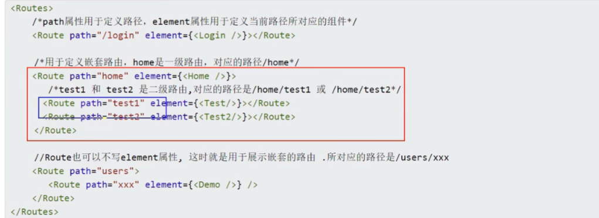

# BrowserRouter
1. 说明: `<BrowserRouter>` 用于包裹整个应用
2. 示例代码:
```jsx
import React from "react";
import { createRoot } from "react-dom/client";
import App from "./App";
import { BrowserRouter } from "react-router-dom";

const rootElement = document.getElementById("root");
if (rootElement) {
  createRoot(rootElement).render(
  <BrowserRouter>
   <App />
  </BrowserRouter>
 );
}
```

# 2. `<HashRouter>`
1. 说明: 作用与<BorowserRouter>一样，但<HashRouter>修改的是地址栏的hash值
2. 备注: 6.x版本中<HashRouter> <BrowserRouter>用法和5.x相同。

# 3. `<Routes/>`与`<Route/>`
1. v6版本中移除了`<Switch>`, 引入了新的替代者：`<Routes>`.
2. `<Routes>`和`<Route>`要配合使用
3. `<Route>`相当于一个if语句，如果其路径与当前的URL匹配则呈现对应的组件。
4. <Route caseSensitive>属性用于指定: 匹配时是否区分大小写(default: false)
5. 当URL发生变化的时候, <Routes> 都会查看其所有子<Route>元素以找到最佳匹配并呈现
6. <Route>也可以嵌套使用，且可以配合useRoutes（）配置"路由表”，但是需要通过<Outlet>组件来渲染子路由
7. 示例代码:

我们的代码里面用的是路由表实现，这里使用的是NavLink嵌套的方式


# 4. `<Link>`
1. 作用: 修改URL, 且不发送网络请求(路由链接)
2. 外侧需要用`<BrowserRouter>`或者`<HashRouter>`包裹
3. 示例代码:
```jsx
import {link} from "react-router-dom";

function Test(){
  return(
    <div>
    <Link to="/path">button</Link>
    </div>
  );
}
```
# 5. `<NavLink>`
1.作用与`<Link>`相似, 可实现导航的高亮效果
2.示例代码:
```jsx
  function computedClassName({isActive}) {
    return isActive? 'list-group-item atguigu': 'list-group-item'
  }
  /*加一个end当子组件高亮的时候父组件停止高亮*/
  <div className="list-group">
    <NavLink className={computedClassName} to="/about">About</NavLink>
    <NavLink className={computedClassName} to="/home" end>Home</NavLink>  
  </div>
```

# 6. `<Navigate>`
1. 只要被渲染就会该路径，切视图
2. replace属性控制跳转模式(push, replace, default: push)
3. 示例代码
```jsx
import React,{useState} from 'react'
import {Navigate} from 'react-router-dom'

export default function Home() {
  const [sum, setSum] = useState(1)
  return (
    <div>
        <h3>我是Home的内容</h3>
        {sum === 2? <Navigate to="/about" replace={true}/> : <h4>当前求和为：{sum}</h4>}
        <button onClick={e => setSum(sum + 1)}>点我+1</button>
    </div>
  )
}
```

# 7. `<Outlet>`
1. `<Route>`有嵌套的时候渲染后续子路由

```jsx
        <br/>
        {/* 指定路由组件呈现的位置 */}
        <Outlet />
```
# Hooks

## 1. useRoute()
更具路由表动态创建`<Routes>` `<Route>`
```jsx
import React from 'react'
import {NavLink, useRoutes} from 'react-router-dom'
import routes from './routes'

export default function App() {
  //根据路由表生成路由组件
  const element = useRoutes(routes)

  return (
    <div>
      <div className="row">
        <div className="col-xs-offset-2 col-xs-8">
          <div className="page-header"><h2>React Router Demo</h2></div>
        </div>
      </div>
      <div className="row">
        <div className="col-xs-2 col-xs-offset-2">
          <div className="list-group">
            <NavLink className="list-group-item" to="/about">About</NavLink>
            <NavLink className="list-group-item" to="/home">Home</NavLink>  
          </div>
        </div>
        <div className="col-xs-6">
          <div className="panel">
            <div className="panel-body">
              {/* 注册路由 6之后switch没有了, Swith 包之后匹配之后不接着匹配了*/}  
              {element}
            </div>
          </div>
        </div>
      </div>
    </div>
```

## 2.useNavigate()
1. 返回一个函数用来实现编程式导航
2. 示例代码:
```jsx
import React from 'react'
import { useNavigate } from 'react-router-dom'

export default function Header() {
  const navigate = useNavigate()
  function back() {
    navigate(-1)
  }

  function forward() {
    navigate(1)
  }
  return (
      <div className="col-xs-offset-2 col-xs-8">
        <div className="page-header">
          <h2>React Router Demo</h2>
          <button onClick={back}>Back</button>
          <button onClick={forward}>Forward</button>
          </div>
      </div>
  )
}
```
## 3.useParams()
1. 给当前匹配路由的params参数
2. 参考06_src

## 4.useSearchParams()
1. 用于URL中search参数
2. 返回包含两个值的数组：当前search参数，更新search的函数
参考07_src

## 5.useLocation
1. 获取state参数
2. 参考08_src

## 6.useMatch()
返回当前匹配信息，对标5中的match属性


## 7.others
useinRouterContext() 是否在导航中 10_src
useNavigationType() push pop or replace 参考11_src

## 8. useOutlet()
useOutlet is a hook provided by react-router-dom v6 (or later) that allows you to access the child route from a parent route. This is useful when you want to render something in the parent route based on whether there's a child route or not.

Here's a basic example of how you might use useOutlet:
```jsx
import { useOutlet } from 'react-router-dom';

function ParentRoute() {
  let outlet = useOutlet();

  return (
    <div>
      <h1>Parent Route</h1>
      {outlet}
      {/*如果嵌套路由没有挂在，值是null*/}
    </div>
  );
}
```
In this example, useOutlet is called inside the ParentRoute component. The useOutlet hook returns the child route (if there is one), which is then rendered inside the ParentRoute component. If there's no child route, useOutlet returns null, and nothing extra is rendered.

展现当前组件中渲染的嵌套路由


## 10. useResolvedPath()
给定一个URL，解析其中的path search hash值
```jsx
  console.log('@@@',useResolvedPath('/users?id=001&name=Tom&age=20#qwe'))
  // resolvedPath is an object with `pathname`, `search`, and `hash` properties
  console.log(resolvedPath.pathname); // Outputs the absolute path, e.g. "/about"

```